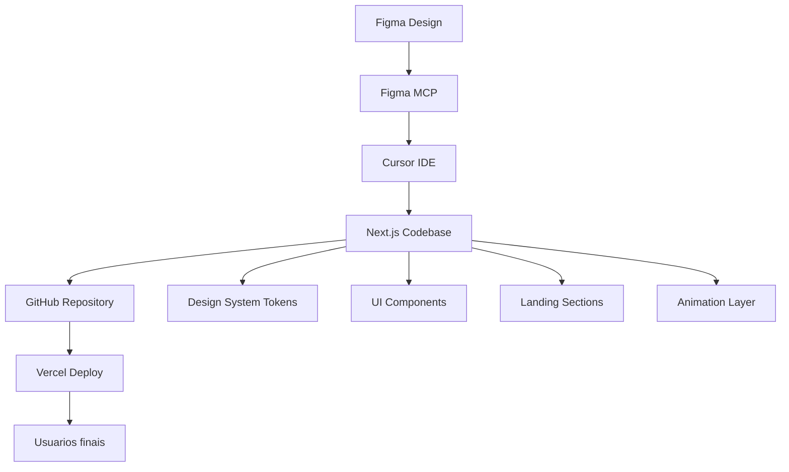
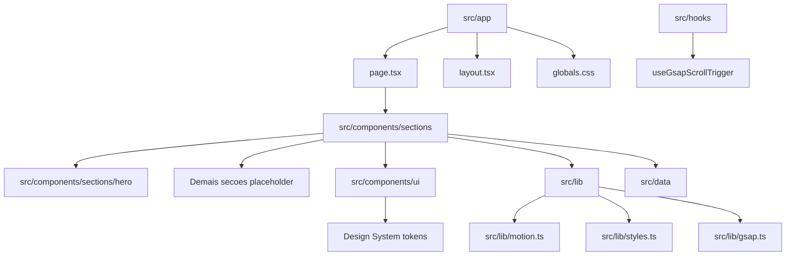
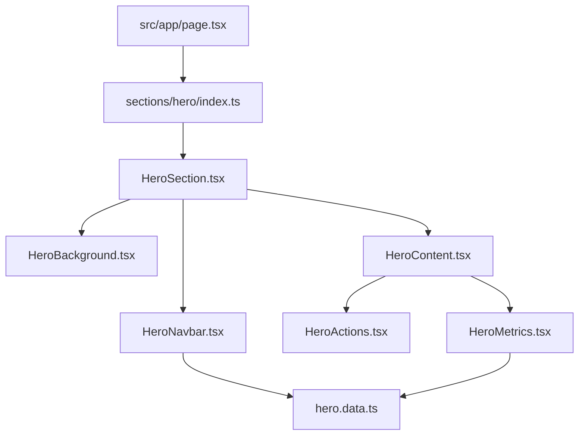
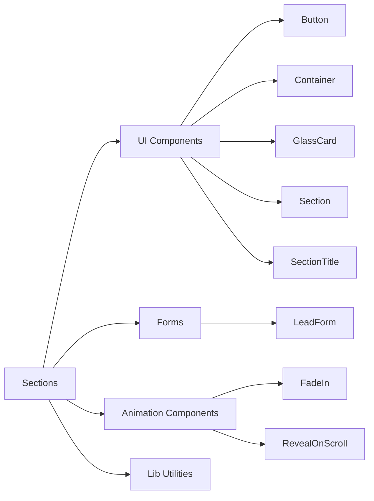
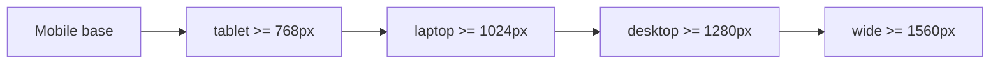
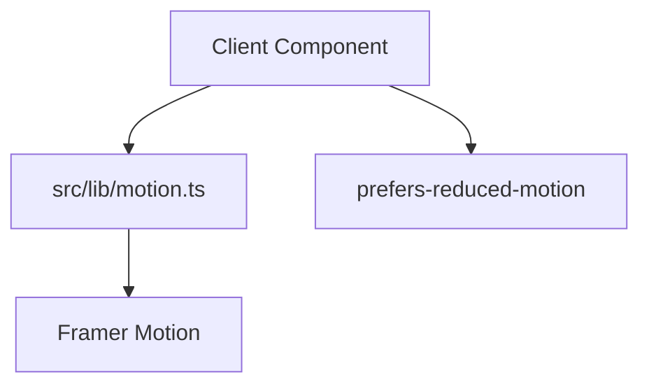
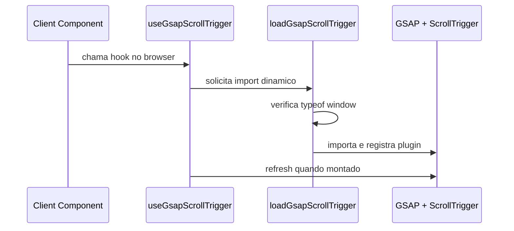
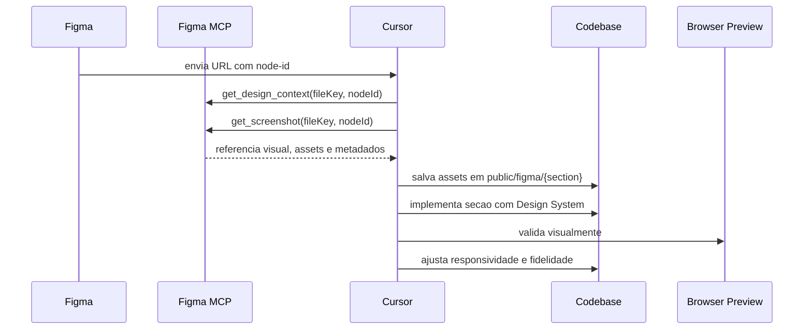
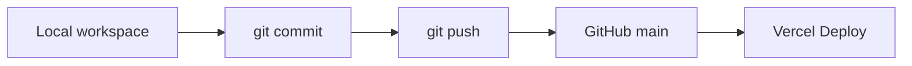
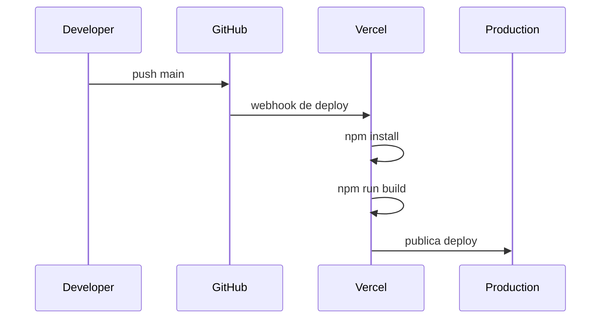

# Arquitetura do Projeto

> Documento historico e explicativo. A base oficial daqui para frente e [Arquitetura definitiva](./architecture/final-architecture.md).

## Visao Geral

O Best2bee Site e uma landing page B2B construida com Next.js App Router, TypeScript, Tailwind CSS, Framer Motion e uma preparacao SSR-safe para GSAP ScrollTrigger.

A arquitetura foi pensada para:

- evoluir por secoes vindas do Figma;
- evitar arquivos gigantes;
- preservar alta fidelidade visual;
- manter Design System centralizado;
- facilitar responsividade premium;
- permitir animacoes sofisticadas sem acoplar logica visual ao layout global;
- sustentar deploy automatico via GitHub e Vercel.

## Diagrama Geral



## Separacao das Camadas



### `src/app`

Responsavel pela camada de aplicacao do App Router.

- `layout.tsx`: metadados, fontes globais e estrutura base HTML.
- `page.tsx`: composicao ordenada da landing page.
- `globals.css`: tokens CSS, resets e estilos globais.

### `src/components/sections`

Responsavel pelas secoes da landing. Cada secao representa um bloco de jornada do usuario.

O estado atual renderiza:

```txt
HeroSection
ProblemSection
SolutionSection
WorkSection
StackSection
SquadsSection
SocialSection
ComplianceSection
CTASection
Footer
```

### `src/components/ui`

Camada de primitives reutilizaveis do Design System.

- `Button`
- `Container`
- `GlassCard`
- `Section`
- `SectionTitle`

### `src/lib`

Camada de utilitarios e infraestrutura front-end.

- `motion.ts`: variants reutilizaveis do Framer Motion.
- `styles.ts`: classes compartilhadas para layout, superficies e botoes.
- `gsap.ts`: loader SSR-safe para GSAP ScrollTrigger.
- `constants.ts`: configuracoes estaticas.
- `animations.ts`: compatibilidade com componentes de animacao existentes.

### `src/hooks`

Hooks client-side compartilhados.

- `useGsapScrollTrigger.ts`: prepara ScrollTrigger no browser sem quebrar SSR.

### `src/data`

Dados estaticos e Design System fonte.

- `design-system.md`: fonte oficial do Design System.
- `sections.ts`: metadados das secoes placeholder.

## Organizacao das Secoes

Secoes simples podem permanecer em arquivo unico enquanto ainda sao placeholders ou possuem baixa complexidade.

```txt
src/components/sections/ProblemSection.tsx
src/components/sections/SolutionSection.tsx
src/components/sections/WorkSection.tsx
```

Secoes complexas devem seguir o padrao de pasta propria:

```txt
src/components/sections/{section}/
  index.ts
  {Section}Section.tsx
  {Section}Content.tsx
  {Section}Background.tsx
  {Section}Actions.tsx
  {Section}Metrics.tsx
  {section}.data.ts
```

## Hero Section

A Hero ja segue o modelo modular.



Responsabilidades:

- `HeroSection.tsx`: composicao, semantica da secao e container principal.
- `HeroBackground.tsx`: imagem, overlay e background decorativo.
- `HeroNavbar.tsx`: navegacao visual da Hero.
- `HeroContent.tsx`: headline, subheadline e orquestracao dos blocos.
- `HeroActions.tsx`: CTAs.
- `HeroMetrics.tsx`: metricas e indicador de scroll.
- `hero.data.ts`: dados estaticos da Hero.
- `index.ts`: API publica da secao.

## Estrutura de Componentes



Regras:

- Componentes UI nao devem conhecer regra de negocio.
- Secoes podem compor UI, motion, dados e assets.
- Dados repetidos saem do JSX para arquivos `*.data.ts`.
- Componentes com browser APIs devem ser client components.

## Estrategia de Responsividade

O projeto usa abordagem mobile-first com breakpoints semanticos no Tailwind:

```txt
tablet:  768px
laptop:  1024px
desktop: 1280px
wide:    1560px
```



Principios:

- O layout base deve funcionar em mobile.
- `Container` centraliza largura maxima e paddings responsivos.
- Tipografia display usa `clamp()` quando precisa preservar fidelidade ao Figma.
- Grids comecam em uma coluna e evoluem conforme o breakpoint.
- Imagens decorativas nao devem causar overflow horizontal.

## Estrategia de Animacoes

Framer Motion e a camada principal para animacoes declarativas.

Variants reutilizaveis:

- `fadeUp`
- `staggerContainer`
- `scaleIn`
- `revealOpacity`



GSAP ScrollTrigger fica preparado para casos mais complexos:



Regras:

- Animacoes devem respeitar reduced motion.
- Preferir `opacity`, `transform` e `scale`.
- Evitar animar propriedades que geram layout shift.
- GSAP nao deve ser importado diretamente em server components.

## Fluxo Figma -> MCP -> Cursor -> Codigo



Regras do fluxo:

- O codigo gerado pelo MCP e referencia, nao implementacao final.
- Assets temporarios devem ser baixados para `public/figma/{section}/`.
- A implementacao deve usar tokens e componentes locais.
- A secao deve ser validada em desktop, tablet e mobile.
- Sempre rodar `typecheck`, `lint` e `build`.

## Integracao com GitHub

Repositorio remoto:

```txt
https://github.com/rixhon/best2bee-site.git
```

Branch principal:

```txt
main
```



Fluxo recomendado:

1. Criar mudanca local.
2. Rodar validacoes.
3. Commitar com mensagem clara.
4. Push para GitHub.
5. Vercel executa build automatico.

## Integracao com Vercel



Configuracao esperada:

- Framework: `Next.js`
- Install command: `npm install`
- Build command: `npm run build`
- Production branch: `main`
- Output directory: default

Variaveis previstas:

```bash
NEXT_PUBLIC_SITE_URL=
NEXT_PUBLIC_CALENDLY_URL=
```

## Principios de Manutencao

- Mantenha a documentacao junto da mudanca.
- Promova secoes complexas para pasta propria.
- Evite abstrair antes de haver repeticao real.
- Preserve tokens do Design System.
- Prefira componentes pequenos e nomes explicitos.
- Registre decisoes arquiteturais em ADRs.

## Referencias Relacionadas

- [Stack tecnologica](./stack.md)
- [Design System](./design-system/README.md)
- [Componentes](./components/README.md)
- [Animacoes](./animations.md)
- [Sistema oficial de animacoes](./components/official-animation-system.md)
- [Responsividade](./responsive.md)
- [Figma MCP](./figma-mcp.md)
- [Git e GitHub](./git-github.md)
- [Deploy Vercel](./deploy-vercel.md)
- [ADRs](./architecture/decisions/README.md)
