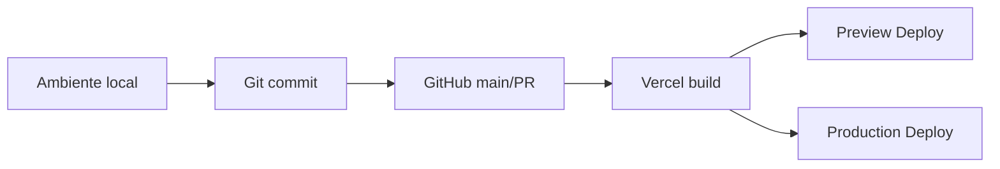
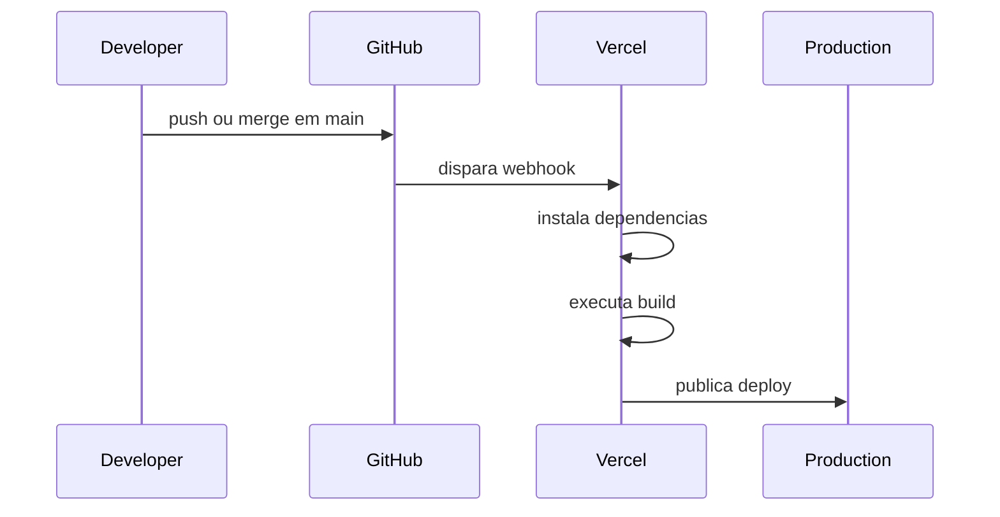
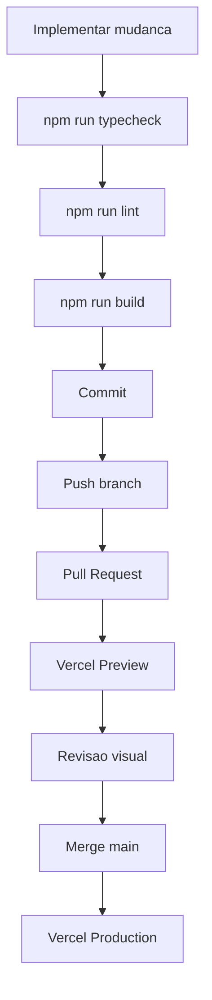

# Deploy

## Objetivo

Este guia documenta o fluxo completo de deploy do Best2bee Site, desde o ambiente local ate producao na Vercel. Ele cobre ambientes, variaveis, GitHub, build process, troubleshooting, rollback, performance e otimizacoes.

## Visao Geral

O projeto usa deploy automatico via GitHub -> Vercel.



## Ambientes

### Ambiente local

Usado para desenvolvimento e validacao antes de push.

URL padrao:

```txt
http://localhost:3000
```

Comando:

```bash
npm run dev
```

Validacoes locais:

```bash
npm run typecheck
npm run lint
npm run build
```

### Ambiente de preview

Criado automaticamente pela Vercel para Pull Requests.

Uso:

- validar mudancas visuais;
- revisar responsividade;
- testar build em ambiente similar ao de producao;
- compartilhar com stakeholders antes do merge.

### Ambiente de producao

Criado a partir da branch `main`.

Uso:

- versao publica estavel;
- deploy automatico apos merge/push em `main`;
- configuracao final de dominio e variaveis de ambiente.

## Estrategia de Deploy

### Deploy de preview

Fluxo:

```txt
feature branch -> Pull Request -> Vercel Preview Deploy
```

Use preview deploy para validar:

- Hero e secoes visuais;
- responsividade;
- assets;
- formularios;
- performance inicial;
- links e anchors.

### Deploy de producao

Fluxo:

```txt
merge/push main -> Vercel Production Deploy
```

`main` deve sempre estar em estado buildavel.

## Integracao com GitHub

Repositorio:

```txt
https://github.com/rixhon/best2bee-site.git
```

Branch de producao:

```txt
main
```

Fluxo:



## Configuracao da Vercel

| Campo | Valor |
|---|---|
| Framework Preset | `Next.js` |
| Install Command | `npm install` |
| Build Command | `npm run build` |
| Output Directory | Default |
| Production Branch | `main` |

## Variaveis de Ambiente

Arquivo de referencia:

```txt
.env.example
```

Variaveis atuais:

```bash
NEXT_PUBLIC_SITE_URL=http://localhost:3000
NEXT_PUBLIC_CALENDLY_URL=
```

### Local

Crie:

```bash
.env.local
```

Exemplo:

```bash
NEXT_PUBLIC_SITE_URL=http://localhost:3000
NEXT_PUBLIC_CALENDLY_URL=
```

### Producao

Configure no painel da Vercel:

```bash
NEXT_PUBLIC_SITE_URL=https://dominio-final.com
NEXT_PUBLIC_CALENDLY_URL=https://calendly.com/...
```

### Regras

- Nunca commitar `.env.local`.
- Variaveis `NEXT_PUBLIC_*` ficam expostas no browser.
- Secrets privados nao devem usar prefixo `NEXT_PUBLIC_`.
- Quando alterar env vars na Vercel, redeploy pode ser necessario.

## Build Process

Scripts reais do projeto:

```json
{
  "dev": "next dev",
  "build": "next build",
  "start": "next start",
  "lint": "eslint .",
  "typecheck": "tsc --noEmit"
}
```

Processo esperado na Vercel:

```txt
npm install
npm run build
Next.js gera build otimizado
Vercel publica artefatos
```

Validacao local equivalente:

```bash
npm install
npm run typecheck
npm run lint
npm run build
```

## Checklist Antes de Deploy

### Codigo

- [ ] `npm run typecheck` passa.
- [ ] `npm run lint` passa.
- [ ] `npm run build` passa.
- [ ] Sem imports quebrados.
- [ ] Sem arquivos temporarios.

### Visual

- [ ] Desktop revisado.
- [ ] Tablet revisado.
- [ ] Mobile revisado.
- [ ] Sem overflow horizontal.
- [ ] Hero preserva LCP e imagem critica.

### Figma/assets

- [ ] Assets do Figma estao em `public/figma/{section}/`.
- [ ] Nenhuma URL temporaria da API do Figma esta em uso.
- [ ] Imagens decorativas usam `alt=""` e/ou `aria-hidden`.
- [ ] Imagens acima da dobra usam `priority` quando necessario.

### Ambiente

- [ ] `NEXT_PUBLIC_SITE_URL` configurado.
- [ ] `NEXT_PUBLIC_CALENDLY_URL` configurado quando houver Calendly real.
- [ ] Variaveis estao configuradas no ambiente correto da Vercel.

### Produto

- [ ] CTAs apontam para destinos existentes.
- [ ] Formulario nao envia para endpoint inexistente em producao.
- [ ] Links internos/anchors funcionam.
- [ ] Documentacao atualizada.

## Performance

Metas recomendadas:

| Metrica | Alvo |
|---|---:|
| LCP | `< 2.5s` |
| CLS | `< 0.05` |
| INP | `< 200ms` |
| Lighthouse mobile | `>= 90` |

## Otimizacoes

### Imagens

- Salvar assets em `public/figma`.
- Converter imagens pesadas para WebP/AVIF quando possivel.
- Usar `next/image`.
- Usar `priority` apenas para imagem acima da dobra.
- Definir `sizes` adequados.
- Lazy-load imagens abaixo da dobra.

### CSS

- Usar tokens Tailwind e CSS variables.
- Evitar CSS duplicado.
- Evitar estilos inline extensos.
- Promover padroes repetidos para componentes.

### JavaScript

- Manter componentes client apenas quando necessario.
- Usar Framer Motion com moderacao.
- Carregar GSAP/ScrollTrigger por import dinamico SSR-safe.
- Evitar bibliotecas extras sem justificativa.

### Fontes

Atualmente as fontes sao carregadas via `next/font`.

Futuro possivel:

- self-host em `public/fonts`;
- preload apenas das fontes criticas;
- revisar CLS.

## Troubleshooting

### Build falha na Vercel, mas passa local

Possiveis causas:

- versao de Node diferente;
- variavel de ambiente ausente;
- arquivo nao commitado;
- dependencia ausente no `package.json`;
- case-sensitive path em ambiente Linux.

Acoes:

- revisar logs da Vercel;
- rodar `npm run build` localmente;
- confirmar arquivos commitados;
- conferir imports com letras maiusculas/minusculas;
- checar env vars na Vercel.

### Erro de variavel de ambiente

Possiveis causas:

- variavel nao configurada na Vercel;
- nome diferente do usado no codigo;
- variavel adicionada sem redeploy.

Acoes:

- conferir Project Settings -> Environment Variables;
- comparar com `.env.example`;
- redeployar.

### Imagens nao aparecem em producao

Possiveis causas:

- asset nao esta em `public`;
- caminho incorreto;
- uso de URL temporaria do Figma;
- arquivo nao commitado.

Acoes:

- verificar `public/figma/{section}`;
- usar caminho `/figma/{section}/arquivo.ext`;
- evitar URLs da API MCP em codigo final;
- confirmar no GitHub se o arquivo existe.

### Deploy saiu com layout quebrado

Acoes:

- validar Preview Deploy antes de promover mudancas visuais;
- comparar com screenshot do Figma;
- checar breakpoints;
- revisar tokens alterados;
- se necessario, fazer rollback na Vercel.

### Formulario nao funciona

Estado atual:

- formulario preparado com React Hook Form + Zod;
- envio real ainda nao conectado a backend/CRM.

Acoes antes de producao:

- definir destino dos leads;
- conectar endpoint;
- tratar sucesso/erro;
- documentar variaveis necessarias.

## Rollback

### Rollback pela Vercel

Use quando um deploy de producao quebrou:

1. Acesse o painel da Vercel.
2. Abra o projeto.
3. Va em `Deployments`.
4. Escolha um deploy estavel.
5. Clique para promover/redeployar.

### Rollback por Git

Use quando a mudanca precisa ser revertida no repositorio:

```bash
git revert <commit_sha>
git push origin main
```

Evite:

```bash
git reset --hard
git push --force
```

em branches compartilhadas ou em `main`.

## Fluxo Operacional Recomendado



## Referencias

- [Git e GitHub](./git-github.md)
- [Arquitetura](./architecture.md)
- [Design System](./design-system/README.md)
- [Figma MCP](./figma-mcp.md)
- [Roadmap tecnico](./roadmap.md)
