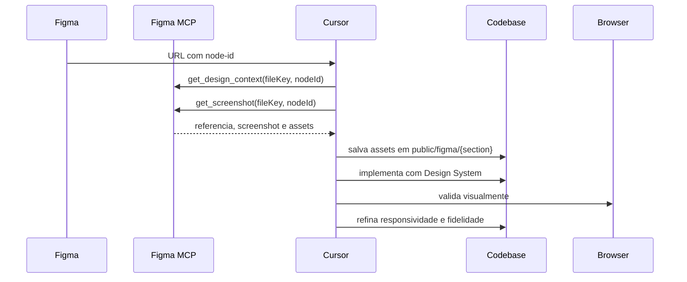

# Integracao MCP do Figma

## Objetivo

A integracao MCP do Figma permite ler designs aprovados no Figma diretamente no Cursor e transformar cada secao da landing page em codigo Next.js + TypeScript + Tailwind CSS com alta fidelidade visual.

O objetivo nao e copiar o codigo gerado pelo Figma literalmente. O MCP fornece referencia visual, metadados, hierarquia, assets e pistas de implementacao. A implementacao final deve sempre ser adaptada ao Design System, arquitetura e componentes deste projeto.

## Escopo da Integracao

Usamos o Figma MCP para:

- ler contexto de design de um node especifico;
- obter screenshots para comparacao visual;
- identificar assets necessarios;
- entender hierarquia de layers;
- validar dimensoes, textos, cores e espacamentos;
- acelerar a implementacao das 9 secoes oficiais da landing.

As secoes oficiais sao:

1. `01 Hero Section`
2. `02 Problem Section`
3. `03 Solution Section`
4. `04 Work Section`
5. `05 Stack Section`
6. `06 Squads Section`
7. `07 Social Section`
8. `08 Compliance Section`
9. `09 CTA Section`

## Servidores MCP Disponiveis

### `user-Figma-Remote`

Servidor oficial remoto. Use quando houver URL do Figma com `fileKey` e `node-id`.

Ferramentas relevantes:

- `whoami`
- `get_design_context`
- `get_screenshot`
- `get_metadata`
- `get_variable_defs`
- `get_libraries`
- `search_design_system`
- `get_figjam`

Uso recomendado para design-to-code:

```txt
get_design_context -> get_screenshot -> baixar assets -> implementar -> comparar
```

### `user-Figma`

Servidor local ligado ao Figma Desktop/current selection. Use quando o arquivo estiver aberto no Figma Desktop e houver um node selecionado.

Ferramentas relevantes:

- `get_design_context`
- `get_screenshot`
- `get_metadata`
- `get_variable_defs`
- `get_figjam`

Uso recomendado:

- validacao rapida da selecao atual;
- leitura de um node quando o link remoto nao esta disponivel;
- iteracao local durante refinamento visual.

## Dependencias

### No projeto

- Next.js
- TypeScript
- Tailwind CSS
- Framer Motion
- Design System local em `src/data/design-system.md`
- tokens em `src/app/globals.css`
- assets em `public/figma/{section}/`

### No ambiente Cursor

- MCP `user-Figma-Remote` autenticado.
- MCP `user-Figma` disponivel quando usar Figma Desktop.
- Acesso ao arquivo Figma aprovado.
- URL do node no formato correto.

## Configuracao Necessaria

### URL do Figma

Formato esperado:

```txt
https://www.figma.com/design/{fileKey}/{fileName}?node-id=1-472&m=dev
```

Extrair:

```txt
fileKey = {fileKey}
nodeId = 1:472
```

Regra:

```txt
node-id=1-472 -> nodeId="1:472"
```

### Assets

Assets retornados pela API do Figma MCP geralmente sao temporarios. Sempre salve localmente:

```txt
public/figma/{section}/
```

Exemplo:

```txt
public/figma/hero/background.png
public/figma/hero/logo.png
public/figma/hero/arrow.svg
```

## Como Validar se Esta Funcionando

### 1. Validar autenticacao remota

Use `user-Figma-Remote.whoami`.

Resultado esperado:

- email do usuario autenticado;
- handle;
- times/planos acessiveis.

Se falhar:

- verificar login no Figma;
- verificar autorizacao do MCP;
- autenticar novamente no Cursor se necessario.

### 2. Validar leitura de metadata

Use `get_metadata` com `fileKey`.

Resultado esperado:

- lista de paginas ou XML simplificado do node;
- IDs, nomes, tipos, posicoes e tamanhos.

### 3. Validar contexto de design

Use `get_design_context` com `fileKey` e `nodeId`.

Resultado esperado:

- referencia React/Tailwind;
- metadados de layers;
- assets referenciados;
- recomendacoes de adaptacao.

### 4. Validar screenshot

Use `get_screenshot` com `fileKey` e `nodeId`.

Resultado esperado:

- URL de screenshot;
- dimensoes renderizadas;
- imagem comparavel com a implementacao local.

## Fluxo de Funcionamento



## Fluxo de Importacao de Design

### 1. Receber a URL do node

Exemplo:

```txt
https://www.figma.com/design/Y8h9vDyjIfKZlwRUnduvYZ/B2B_Landpage?node-id=1-472&m=dev
```

Extracao:

```txt
fileKey = Y8h9vDyjIfKZlwRUnduvYZ
nodeId = 1:472
```

### 2. Consultar contexto

Ferramenta:

```txt
user-Figma-Remote.get_design_context
```

Parametros:

```json
{
  "fileKey": "Y8h9vDyjIfKZlwRUnduvYZ",
  "nodeId": "1:472",
  "clientLanguages": "typescript,css",
  "clientFrameworks": "next.js,react"
}
```

### 3. Consultar screenshot

Ferramenta:

```txt
user-Figma-Remote.get_screenshot
```

Parametros:

```json
{
  "fileKey": "Y8h9vDyjIfKZlwRUnduvYZ",
  "nodeId": "1:472",
  "maxDimension": 1600,
  "contentsOnly": false
}
```

### 4. Salvar assets

Baixe imagens, SVGs e backgrounds para:

```txt
public/figma/{section}/
```

Nunca dependa de URLs temporarias da API do Figma em producao.

### 5. Implementar a secao

Secoes simples podem ser arquivo unico:

```txt
src/components/sections/ProblemSection.tsx
```

Secoes complexas devem usar pasta propria:

```txt
src/components/sections/problem/
  ProblemSection.tsx
  ProblemContent.tsx
  ProblemBackground.tsx
  problem.data.ts
  index.ts
```

### 6. Adaptar ao Design System

Use:

- `Container`
- `Section`
- `SectionTitle`
- `Button`
- `GlassCard`
- tokens Tailwind `b2b-*`
- variants de `src/lib/motion.ts`

Evite:

- CSS inline;
- copiar classes absolutas geradas pelo Figma sem revisao;
- hardcode sem motivo;
- assets remotos temporarios;
- componentes gigantes.

### 7. Validar visualmente

Compare:

- screenshot do Figma;
- render local em desktop;
- render local em tablet;
- render local em mobile.

### 8. Validar build

```bash
npm run typecheck
npm run lint
npm run build
```

## Boas Praticas

### Codigo

- O output do MCP e referencia, nao fonte final.
- Adapte sempre ao stack local.
- Priorize semantica HTML.
- Use componentes locais.
- Extraia dados repetidos para `*.data.ts`.
- Divida secoes grandes em subcomponentes.
- Mantenha a secao isolada: uma secao nao deve depender de detalhes internos de outra.

### Design System

- Use tokens antes de valores arbitrarios.
- Use Honey apenas em CTAs, eyebrows e detalhes.
- Preserve `Glass + Light` nos cards.
- Use Space Grotesk em headings.
- Use JetBrains Mono em eyebrows e labels tecnicas.
- Use Inter para corpo e UI.

### Assets

- Salve em `public/figma/{section}/`.
- Nomeie por funcao: `background.png`, `logo.svg`, `illustration.webp`.
- Use `next/image` para imagens relevantes.
- Use `priority` apenas em imagens acima da dobra.
- Use `alt=""` e `aria-hidden` para imagens decorativas.

### Performance

- Otimize imagens pesadas para WebP/AVIF quando possivel.
- Evite importar bibliotecas extras por secao.
- Lazy-load imagens abaixo da dobra.
- Preserve LCP da Hero.

## Troubleshooting

### `whoami` falha

Possiveis causas:

- usuario nao autenticado;
- token expirado;
- MCP nao autorizado.

Acoes:

- autenticar novamente no Figma/Cursor;
- verificar se o servidor MCP esta ativo;
- tentar novamente com `whoami`.

### `get_design_context` retorna erro de permissao

Possiveis causas:

- usuario nao tem acesso ao arquivo;
- arquivo esta em time/organizacao diferente;
- URL/fileKey incorreto.

Acoes:

- abrir o arquivo no navegador logado;
- confirmar permissao no Figma;
- validar `fileKey`;
- usar `whoami` para confirmar a conta autenticada.

### `nodeId` invalido

Possiveis causas:

- `node-id` nao foi convertido corretamente;
- URL aponta para pagina sem node especifico;
- node foi removido ou renomeado.

Acoes:

- converter `1-472` para `1:472`;
- pedir URL com node selecionado;
- usar `get_metadata` para listar paginas/nodes.

### Screenshot nao bate com o Figma aberto

Possiveis causas:

- node errado;
- `contentsOnly` diferente do esperado;
- zoom/viewport local diferente;
- fonte ou asset nao aplicado no codigo.

Acoes:

- conferir nodeId;
- testar `contentsOnly: false`;
- comparar dimensoes retornadas;
- baixar novamente assets.

### Imagem some depois de alguns dias

Causa:

- URL da API do Figma era temporaria.

Acao:

- baixar asset para `public/figma/{section}/`;
- atualizar o componente para usar caminho local.

### Codigo gerado pelo MCP parece ruim

Isso e esperado. O codigo gerado pode ter:

- posicionamento absoluto excessivo;
- classes Tailwind muito literais;
- estilos inline;
- estrutura pouco semantica.

Acao:

- usar o resultado como mapa visual;
- reconstruir com componentes locais;
- preservar semantica, responsividade e tokens.

## Checklist Operacional por Secao

- [ ] URL do Figma possui `node-id`.
- [ ] `fileKey` extraido.
- [ ] `nodeId` convertido para `:` corretamente.
- [ ] `get_design_context` executado.
- [ ] `get_screenshot` executado.
- [ ] Assets baixados para `public/figma/{section}/`.
- [ ] Secao implementada com componentes locais.
- [ ] Design System respeitado.
- [ ] Desktop comparado com screenshot.
- [ ] Tablet revisado.
- [ ] Mobile revisado.
- [ ] Acessibilidade revisada.
- [ ] `npm run typecheck` passou.
- [ ] `npm run lint` passou.
- [ ] `npm run build` passou.

## Exemplo Real do Projeto

Hero Section:

```txt
Figma URL:
https://www.figma.com/design/Y8h9vDyjIfKZlwRUnduvYZ/B2B_Landpage?node-id=1-472&m=dev

fileKey:
Y8h9vDyjIfKZlwRUnduvYZ

nodeId:
1:472

Assets:
public/figma/hero/

Codigo:
src/components/sections/hero/
```

## Referencias

- [Arquitetura](./architecture.md)
- [Design System](./design-system/README.md)
- [Componentes](./components/README.md)
- [Guia: adicionando uma nova secao](./guides/adding-a-section.md)
