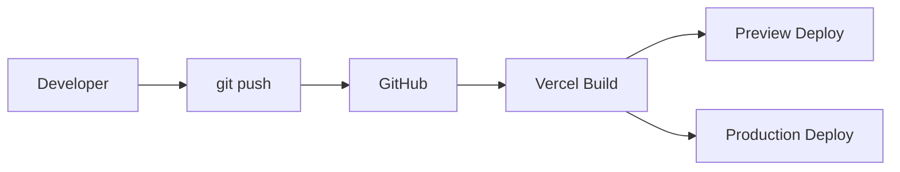

# Git e GitHub

## Objetivo

Este documento define o fluxo profissional de Git e GitHub para o projeto Best2bee Site. Ele deve orientar desenvolvimento individual e em equipe, cobrindo branches, commits, pull requests, versionamento, releases, sincronizacao com o remoto e integracao com Vercel.

## Repositorio

Remote principal:

```txt
https://github.com/rixhon/best2bee-site.git
```

Branch principal:

```txt
main
```

`main` representa o estado pronto para deploy de producao. Todo push em `main` pode disparar deploy automatico na Vercel.

## Estrategia de Branches

O projeto usa uma estrategia simples baseada em trunk-based development com Pull Requests.

### Branches principais

| Branch | Uso |
|---|---|
| `main` | Codigo estavel e deployavel |
| `feature/*` | Novas funcionalidades ou secoes |
| `fix/*` | Correcoes de bug |
| `docs/*` | Documentacao |
| `refactor/*` | Refatoracoes sem mudanca visual/funcional esperada |
| `chore/*` | Configuracoes, scripts e manutencao |
| `release/*` | Preparacao opcional de release |

### Exemplos

```bash
git checkout -b feature/problem-section
git checkout -b fix/hero-mobile-overflow
git checkout -b docs/figma-mcp-guide
git checkout -b refactor/hero-components
```

### Regras

- Nunca trabalhe diretamente em `main` quando houver colaboracao ativa.
- Branches devem ser curtas e objetivas.
- Uma branch deve representar uma entrega revisavel.
- Evite misturar refactor, feature e docs sem necessidade.

## Como Sincronizar o Repositorio

Antes de iniciar uma tarefa:

```bash
git checkout main
git pull origin main
```

Criar branch:

```bash
git checkout -b feature/nome-curto
```

Durante o trabalho, confira estado:

```bash
git status
```

Atualizar branch com `main`:

```bash
git checkout main
git pull origin main
git checkout feature/nome-curto
git merge main
```

Se houver conflitos:

1. Resolva manualmente.
2. Rode validacoes.
3. Faça commit da resolucao.

Evite `git rebase` em branches compartilhadas sem alinhamento com o time.

## Convencoes de Commit

Use commits claros, pequenos e orientados a intencao.

Formato recomendado:

```txt
tipo: descricao curta
```

Tipos:

| Tipo | Uso |
|---|---|
| `feat` | Nova funcionalidade ou nova secao |
| `fix` | Correcao de bug |
| `refactor` | Mudanca interna sem alterar comportamento esperado |
| `docs` | Documentacao |
| `style` | Ajustes visuais/CSS sem mudanca funcional |
| `chore` | Configuracoes, scripts, manutencao |
| `perf` | Performance |
| `test` | Testes |
| `build` | Build, dependencias, tooling |

Exemplos:

```bash
git commit -m "feat: implement hero section"
git commit -m "refactor: split hero into subcomponents"
git commit -m "docs: document figma mcp workflow"
git commit -m "fix: adjust hero mobile spacing"
git commit -m "chore: update vercel docs"
```

Boas praticas:

- Prefira commits pequenos.
- Nao commite codigo quebrado.
- Nao inclua arquivos de ambiente.
- Nao use mensagens vagas como `update`, `fix things`, `changes`.

## Fluxo de Pull Request

### Quando abrir PR

Abra PR para:

- novas secoes vindas do Figma;
- mudancas em arquitetura;
- refatoracoes relevantes;
- ajustes de Design System;
- documentacao estrutural;
- mudancas que afetam deploy.

### Titulo do PR

Use o mesmo estilo dos commits:

```txt
feat: implement problem section
docs: add git workflow documentation
refactor: reorganize hero architecture
```

### Descricao recomendada

```md
## Summary
- O que mudou
- Por que mudou

## Test plan
- [ ] npm run typecheck
- [ ] npm run lint
- [ ] npm run build
- [ ] Validacao visual desktop
- [ ] Validacao visual mobile

## Notes
- Riscos, trade-offs ou pendencias
```

### Checklist de PR

- [ ] Escopo do PR esta claro.
- [ ] Branch esta atualizada com `main`.
- [ ] Nao ha arquivos secretos.
- [ ] Nao ha alteracoes geradas desnecessarias.
- [ ] Documentacao foi atualizada quando necessario.
- [ ] Screenshots foram anexados quando houver mudanca visual.
- [ ] Preview Deploy da Vercel foi validado.

## Revisao de Codigo

O revisor deve olhar:

- fidelidade ao Figma;
- uso correto do Design System;
- responsividade;
- semantica HTML;
- acessibilidade;
- performance;
- separacao de responsabilidades;
- tamanho dos componentes;
- ausencia de hardcodes desnecessarios.

## Versionamento

O projeto ainda esta em fase inicial (`0.1.0`). Para releases formais, usar SemVer:

```txt
MAJOR.MINOR.PATCH
```

| Tipo | Quando usar |
|---|---|
| `MAJOR` | Mudancas incompatíveis ou reestruturacao grande |
| `MINOR` | Novas secoes/features sem quebrar comportamento |
| `PATCH` | Correcoes pequenas |

Exemplos:

```txt
0.2.0 -> novas secoes implementadas
0.2.1 -> ajuste visual ou bugfix
1.0.0 -> primeira versao publica completa
```

## Fluxo de Releases

### Release simples via `main`

1. Merge do PR aprovado em `main`.
2. GitHub dispara webhook para Vercel.
3. Vercel executa build.
4. Deploy de producao e publicado.

### Release formal

Quando o projeto estiver pronto para versoes publicas:

```bash
npm version minor
git push origin main --tags
```

Depois, criar GitHub Release com:

- versao;
- resumo;
- principais mudancas;
- screenshots quando houver mudanca visual;
- notas de migracao se necessario.

### Changelog

Atualize:

```txt
docs/changelog.md
```

Use secoes:

- `Added`
- `Changed`
- `Fixed`
- `Removed`
- `Notes`

## Integracao com Vercel

Fluxo:



Regras:

- Push em `main` gera deploy de producao.
- Pull Request gera Preview Deploy.
- Antes de mergear PR visual, validar Preview Deploy.
- Variaveis de ambiente devem ser configuradas no painel da Vercel.

Configuracao esperada:

| Campo | Valor |
|---|---|
| Framework | Next.js |
| Install Command | `npm install` |
| Build Command | `npm run build` |
| Output Directory | Default |
| Production Branch | `main` |

## Checklist Antes de Deploy

Execute localmente:

```bash
npm run typecheck
npm run lint
npm run build
```

Checklist:

- [ ] Build local passa.
- [ ] Sem erros de lint.
- [ ] Sem erros de TypeScript.
- [ ] Preview visual revisado.
- [ ] Mobile revisado.
- [ ] Assets do Figma estao em `public/figma`.
- [ ] Nenhuma URL temporaria da API do Figma esta em uso.
- [ ] Variaveis de ambiente necessarias estao na Vercel.
- [ ] Formulario nao envia para endpoint inexistente em producao.
- [ ] Documentacao atualizada.

## Boas Praticas

### Fazer

- Trabalhar em branches curtas.
- Usar commits descritivos.
- Rodar validacoes antes de push/PR.
- Atualizar docs junto com mudancas arquiteturais.
- Preferir PRs pequenos.
- Usar Preview Deploy para validar mudancas visuais.

### Evitar

- Commits grandes demais.
- Alterar Design System sem documentar.
- Fazer push direto em `main` em contexto de time.
- Versionar `.env.local`.
- Deixar assets apontando para URLs temporarias.
- Misturar refactor grande com feature visual.

## Arquivos que Nao Devem Ir para Git

- `.env`
- `.env.local`
- `node_modules/`
- `.next/`
- arquivos temporarios do sistema
- screenshots locais temporarios

## Comandos Uteis

Ver estado:

```bash
git status --short --branch
```

Ver remoto:

```bash
git remote -v
```

Atualizar `main`:

```bash
git checkout main
git pull origin main
```

Criar branch:

```bash
git checkout -b feature/nome
```

Enviar branch:

```bash
git push -u origin feature/nome
```

Ver ultimos commits:

```bash
git log --oneline -10
```

## Recuperacao e Rollback

### Rollback de deploy

Use o painel da Vercel:

1. Acesse o projeto.
2. Abra `Deployments`.
3. Escolha um deploy estavel.
4. Promova para producao.

### Reverter commit

Para desfazer uma mudanca ja publicada, prefira `git revert`:

```bash
git revert <commit_sha>
git push
```

Evite `git reset --hard` ou `push --force` em branch compartilhada.

## Referencias

- [Deploy Vercel](./deploy-vercel.md)
- [Changelog](./changelog.md)
- [Arquitetura](./architecture.md)
- [Padroes de codigo](./code-standards.md)
